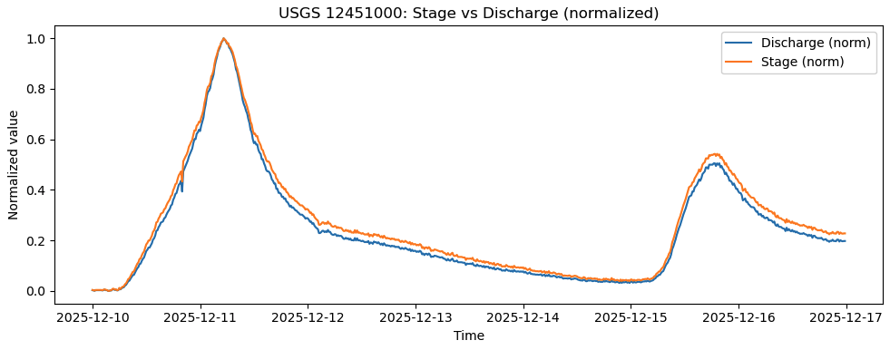

# Multimodal Data Reveal Climatic Connections to Stehekin, WA Debris Flows in December 2025

## Overview

In December 2025, atmospheric river storms delivered sustained precipitation to the North Cascades of Washington State. These events coincided with destructive debris flows in **Stehekin, Washington**, a region affected by recent wildfires. The loss of vegetation and root structure reduced soil cohesion, making hillslopes highly sensitive to saturation-driven failure.

Debris flow initiation is primarily controlled by **soil moisture**, which reflects a balance between:

- **Flux into the system** (precipitation)
- **Flux out of the system** (hydrologic drainage)

Because direct soil moisture observations are limited, this analysis uses precipitation, river discharge, and seismic data to reconstruct basin-scale saturation conditions.

---

## NOAA Precipitation Data

Daily precipitation data were retrieved via NOAA APIs and plotted as a time series covering December 2025. Two sustained precipitation maxima are evident:

- **December 9–13**
- **December 16**

These events represent strong flux into the soil moisture system. However, precipitation alone does not constrain soil stability because it lacks information on subsurface drainage efficiency.

## USGS Stream Gauge Data

Hydrologic response was quantified using USGS stream gauge data from station **12451000 (Stehekin River)**. This analysis uses the following uploaded datasets:

- `usgs_12451000_iv_discharge_2025-12-10_to_2025-12-16.csv`
- `usgs_12451000_iv_stage_2025-12-10_to_2025-12-16.csv`

In the notebook, these files are loaded into the following dataframes:

- `q_df` → discharge data  
- `h_df` → stage (river height) data  

Key variables:
- `["datetime"]`
- `["discharge_cfs"]`
- `["datetime"]`
- `["stage_ft"]`

To compare hydrologic responses, normalized discharge and stage are computed as:

- `["Q_norm"]`
- `["H_norm"]`

Peak discharge occurs on **December 11, 2025**, reaching approximately **14,000 ft³/s**, indicating basin-wide saturation and exceeded drainage capacity.

**USGS Stehekin River discharge and stage response, December 10–16, 2025.**  
Discharge (`q_df["discharge_cfs"]`) and stage (`h_df["stage_ft"]`) peak on December 11, indicating maximum watershed saturation.

---

## Synthesis and Interpretation

The multimodal datasets reveals a sequence:

1. Sustained precipitation increased basin-wide soil moisture.
2. Stream discharge peaked as drainage capacity was exceeded.
3. Debris flows initiated during peak hydrologic loading in a post-fire landscape.

The alignment between precipitation forcing, hydrologic response, and seismic debris flow signatures confirms that **antecedent saturation**, not instantaneous rainfall alone, controlled slope failure in December 2025.

---

## Data Accessibility and Reproducibility

All datasets used in this analysis are publicly available:

- **USGS**: Stream gauge data (Station 12451000)
- **IRIS / PNSN**: Seismic waveform data from UW stations

USGS datasets used directly in this workflow are archived locally as:

1. `usgs_12451000_iv_discharge_2025-12-10_to_2025-12-16.csv` 
    - This dataset contains 15-minute instantaneous river stage measurements 
2. `usgs_12451000_iv_stage_2025-12-10_to_2025-12-16.csv`
    - This dataset contains 15-minute steam discharge measurements

